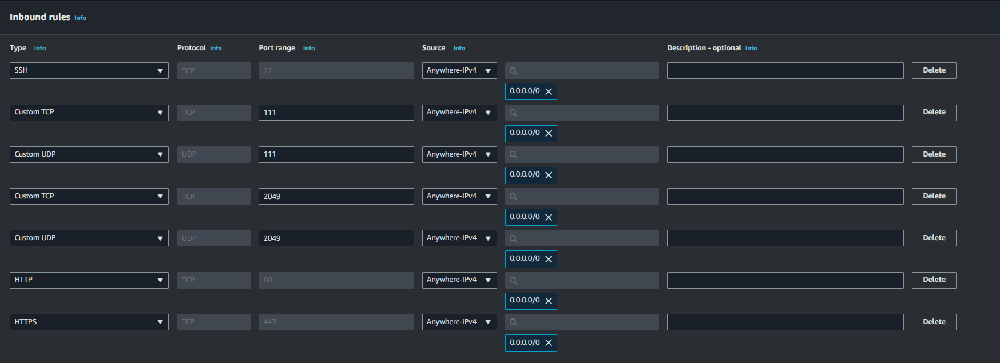

<h1 style="color:blue; font-size: 2em;">Acessando o Console AWS</h1>

Acessar o console AWS access portal (awsapps.com) e fazer o login com a conta Compass;
Ao acessar o console AWS entre em sua conta;


A próxima tela será a página Home do console que pode variar dependendo de sua personalização;


<h1 style="color:blue; font-size: 2em;">Criando uma instância EC2</h1>

Para criar uma instância EC2 (Elastic Compute Cloud) na AWS você pode seguir o passo a passo abaixo:

No console vá para o serviço EC2. Para isso clique em **All Services** no canto superior esquerdo e em seguida escolha **EC2** na seção Compute. Ou utilize o campo de pesquisa na parte superior da tela digitando EC2.


No painel do EC2 clique no botão **Launch Instance**.


Na próxima página você precisará fornecer um nome para a instância e escolher algumas configurações de **TAGs**.

**Por que usar TAGs?**

- **Organização**: TAGs ajudam a organizar recursos permitindo categorizá-los por projeto, departamento, ambiente (produção, teste, etc.) ou qualquer outro critério relevante.
- **Gerenciamento de custos**: Ao atribuir TAGs a recursos você pode rastrear e associar custos a diferentes departamentos, projetos ou equipes facilitando a alocação de custos.
- **Busca e filtragem**: TAGs facilitam a busca e filtragem de recursos dentro do console AWS, especialmente quando você tem muitos recursos.
- **Automação**: Tags podem ser usadas em scripts e automações para identificar e operar em um conjunto específico de recursos.

Escolha um nome para sua atividade, no caso usarei "Atividade Linux", e em seguida clique em "Add additional tags".


Na tela aberta, crie as **TAGs** de acordo com sua necessidade na opção **Add new tag** (1). Para os projetos da Compass usamos o padrão da imagem abaixo.


A **AMI** é o sistema operacional e o software pré-configurado que a sua instância EC2 usará.

Em **Application and OS Images (Amazon Machine Image - AMI)** você pode escolher uma imagem baseada em Linux (Ubuntu, Amazon Linux, Red Hat, etc.) ou Windows. Neste caso, usaremos a imagem solicitada no projeto:
**"Criar 1 instância EC2 com o sistema operacional Amazon Linux 2"**.


Em **Instance type**, nosso projeto solicita uma configuração:
**"Família t3.small"**.


Para gerar uma chave pública para acesso ao ambiente AWS, você precisa criar um par de chaves (chave pública e chave privada) que será usado para autenticação.
Ao criar uma instância EC2 você será solicitado a escolher ou criar um par de chaves na seção **Key Pair (login)**. Vamos criar uma nova.

- Nomeie o par de chaves e selecione o formato de arquivo:
  - **PEM** (usado para Linux/Unix).
  - **PPK** (usado para Windows com PuTTY).
  
Criaremos uma **PEM** pois utilizaremos para acesso no Linux.


Devido ao projeto envolver acesso a um servidor web as opções **Allow HTTPS traffic from the internet** e **Allow HTTP traffic from the internet** foram habilitadas.


<h1 style="color:blue; font-size: 2em;">Liberando as portas de comunicação</h1>

Um **Security Group** na Amazon Web Services (AWS) é uma configuração de firewall virtual que controla o tráfego de entrada e saída de recursos da AWS como instâncias EC2. Ele define as regras que determinam quais tipos de tráfego podem alcançar ou sair de uma instância EC2, funcionando como uma camada adicional de segurança.

Acesse o Console AWS. No console do EC2, clique em **Security Groups** no painel de navegação à esquerda e em **Create Security Group**.


Preencha as seguintes informações:
- **Name**: Insira um nome descritivo para o Security Group (ex.: AtvLinux).
- **Description**: Adicione uma descrição que ajude a identificar a finalidade desse grupo (ex.: Grupo de segurança para servidor web com HTTP e SSH liberados).
- **VPC**: Escolha a VPC em que você deseja criar o Security Group (a maioria dos usuários terá apenas uma VPC padrão).


Adicionar as regras de entrada da nossa Instancia:


**Resumo das Regras Adicionadas:**

| Tipo        | Protocolo | Faixa de portas | Origem       |
|-------------|-----------|-----------------|--------------|
| SSH         | TCP       | 22              | 0.0.0.0/0    |
| Custom TCP  | TCP       | 111             | 0.0.0.0/0    |
| Custom UDP  | UDP       | 111             | 0.0.0.0/0    |
| Custom TCP  | TCP       | 2049            | 0.0.0.0/0    |
| Custom UDP  | UDP       | 2049            | 0.0.0.0/0    |
| HTTP        | TCP       | 80              | 0.0.0.0/0    |
| HTTPS       | TCP       | 443             | 0.0.0.0/0    |

Uma boa prática é adicionar as **TAGs** para manter a organização.


Mensagem de que nosso grupo de segurança foi criado com êxito.


Não esqueça de associar o security group na instância que foi criada.

A instância já está pronta e com as configurações solicitadas para nosso projeto.


<h1 style="color:blue; font-size: 2em;">Instalando e Configurando o NFS</h1>

Atualizando os pacotes do servidor. Antes de instalar o NFS, é sempre bom garantir que seu sistema esteja com os pacotes atualizados:

```bash
sudo yum update -y
```


Agora que os pacotes foram atualizados, execute o comando abaixo para instalar o serviço do NFS:

```bash
sudo yum install nfs-utils -y
```


Após a instalação, você precisa iniciar o serviço NFS e garantir que ele seja iniciado automaticamente quando o sistema for reinicializado:

```bash
sudo systemctl start nfs-server
sudo systemctl enable nfs-server
```


Você pode verificar se o NFS está rodando corretamente com o comando:

```bash
sudo systemctl status nfs-server
```


<h1 style="color:blue; font-size: 2em;">Criando o diretório que será compartilhado</h1>

Agora precisamos criar o diretório no servidor que será compartilhado via NFS. Este diretório será acessível pelos clientes na rede.

Execute o seguinte comando para criar o diretório:

```bash
sudo mkdir -p /mnt/saulo
```


**Explicação**:
- `mkdir`: Cria um diretório.
- `-p`: Garante que o diretório será criado mesmo que os diretórios pais (como `/mnt`) ainda não existam.

<h1 style="color:blue; font-size: 2em;">Configurando permissões no diretório compartilhado</h1>

Defina permissões apropriadas para o diretório, permitindo que clientes NFS possam acessá-lo. Execute os seguintes comandos:

```bash
sudo chown nobody:nogroup /mnt/saulo
sudo chmod 777 /mnt/saulo
```


**Explicação**:
- `chown`: Altera o proprietário do diretório para o usuário `nobody` e o grupo `nogroup`, o que garante que o diretório seja acessível de forma genérica.
- `chmod 777`: Garante que qualquer usuário (local ou remoto) tenha permissão para ler, escrever e executar dentro desse diretório.

<h1 style="color:blue; font-size: 2em;">Configurando permissões no arquivo /etc/exports</h1>

Certifique-se de que o arquivo `/etc/exports` no servidor NFS está configurado para permitir o acesso público. Você precisa abrir o arquivo de configuração do NFS para adicionar essa linha. Faça isso com um editor de texto como o nano.

Abra o arquivo `/etc/exports`:

```bash
sudo nano /etc/exports
```


Adicione a linha de configuração abaixo ao arquivo:

```
/mnt/saulo *(rw,sync,no_subtree_check,no_root_squash)
```


**Explicação**:
- `/mnt/saulo`: O diretório a ser compartilhado.
- `*`: Permite acesso de qualquer IP.
- `rw`: Os clientes podem ler e escrever no diretório.
- `sync`: Gravações são feitas imediatamente no disco do servidor.
- `no_subtree_check`: Desativa verificações de subárvore para melhorar o desempenho.
- `no_root_squash`: Permite que clientes root tenham permissões de root no servidor (use com cuidado).

Depois de adicionar a linha, salve o arquivo:
- Pressione `Ctrl + X` para sair.
- Pressione `Y` para confirmar que deseja salvar as alterações.
- Pressione `Enter` para confirmar o nome do arquivo.

Depois de salvar o arquivo `/etc/exports`, você precisa recarregar as configurações do NFS para que as novas regras entrem em vigor.

Execute o comando:

```bash
sudo exportfs -ra
```



---

<h1 style="color:blue; font-size: 2em;">Acessando o NFS</h1>

1. Use uma máquina Linux para acessar com a chave `.pem`. Neste caso, foi utilizada uma máquina virtual com o Debian instalado.

2. Instalar o Cliente NFS (Se Ainda Não Estiver Instalado):

```bash
sudo apt-get update
sudo apt-get install -y nfs-common
```


3. Crie um diretório onde o compartilhamento NFS será montado:

```bash
sudo mkdir -p /mnt/nfs_shared
```


4. Configurar a Montagem Automática no `/etc/fstab`:

```bash
sudo nano /etc/fstab
```


5. Adicione a seguinte linha ao final do arquivo `/etc/fstab`:

```
18.116.157.143:/mnt/saulo /mnt/nfs_shared nfs defaults 0 0
```


6. Monte o diretório compartilhado manualmente:

```bash
sudo mount -a
```


<h1 style="color:blue; font-size: 2em;">Instalando o Apache</h1>

1. Atualize o servidor. Antes de instalar o Apache, é recomendável atualizar os pacotes do sistema:
   ```bash
   sudo yum update -y
   ```
   

2. Agora instale o Apache no seu servidor:
   ```bash
   sudo yum install httpd -y
   ```
   

3. Depois da instalação, inicie o serviço do Apache e configure-o para iniciar automaticamente no boot:
   ```bash
   sudo systemctl start httpd
   sudo systemctl enable httpd
   ```
   

4. Certifique-se de que o Apache está rodando corretamente:
   ```bash
   sudo systemctl status httpd
   ```
   

<h1 style="color:blue; font-size: 2em;">Script de monitoramento</h1>

**Objetivo**: Criar um script de monitoramento do servidor Apache onde o script deve conter:
- Data / Hora;
- Nome do Serviço;
- Status do serviço; 
- Mensagem personalizada de online ou offline;

O script deve gerar 2 arquivos de saída: 1 para o serviço online e 1 para o serviço offline.

1. Acesse a máquina onde você deseja executar o script (no caso `ec2-user@18.116.157.143`).
2. Navegue até o diretório onde deseja criar o script, por exemplo, `/home/ec2-user`.
3. Use um editor de texto para criar o script `CheckApache.sh`.

```bash
#!/bin/bash
SERVICO="httpd"
DATA_HORA=$(date "+%Y-%m-%d %H:%M:%S")

if systemctl is-active --quiet $SERVICO; then
    STATUS="ONLINE"
    MENSAGEM="O serviço $SERVICO está funcionando corretamente."
    echo "$DATA_HORA - $SERVICO - $STATUS - $MENSAGEM" >> /mnt/saulo/servico_online.log
else
    STATUS="OFFLINE"
    MENSAGEM="O serviço $SERVICO está parado ou enfrentando problemas."
    echo "$DATA_HORA - $SERVICO - $STATUS - $MENSAGEM" >> /mnt/saulo/servico_offline.log
fi
```
   

4. Torne o script executável:
   ```bash
   chmod +x /home/ec2-user/CheckApache.sh
   ```
   

5. Execute o script manualmente para verificar se ele funciona:
   ```bash
   /home/ec2-user/CheckApache.sh
   ```
   

<h1 style="color:blue; font-size: 2em;">Automatizando o Script</h1>

O `crontab` é uma ferramenta do sistema Linux usada para agendar a execução automática de tarefas em horários específicos.

1. Para editar as tarefas do cron para o usuário atual (neste caso `ec2-user`), use o seguinte comando:
   ```bash
   crontab -e
   ```
   

2. Adicione a seguinte linha ao `crontab` para executar o script a cada 5 minutos e redirecionar a saída para um log em `/tmp`:
   ```
   */5 * * * * /bin/bash /home/ec2-user/CheckApache.sh >> /tmp/CheckApache.log 2>&1
   ```
   

<h1 style="color:blue; font-size: 2em;">Exibindo Logs na Página do Apache</h1>

1. Acesse o servidor via SSH.
2. Navegue para o diretório da web do Apache:
   ```bash
   cd /var/www/html
   ```
   

3. Crie um arquivo PHP chamado `exibir_logs.php`.

```php
<?php
// Adicione o conteúdo do código PHP aqui
?>
```
   

4. Reinicie o Apache para aplicar as alterações:
   ```bash
   sudo systemctl restart httpd
   ```
   

5. Acesse a página criada no navegador para visualizar os logs:
   ```
   http://18.116.157.143/exibir_logs.php
   ```
   
