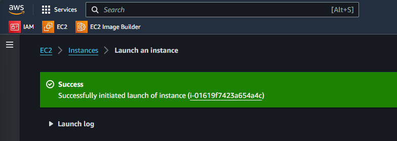
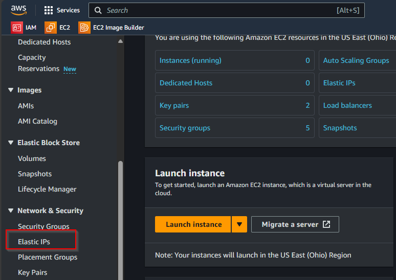
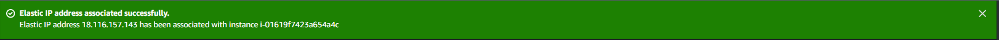
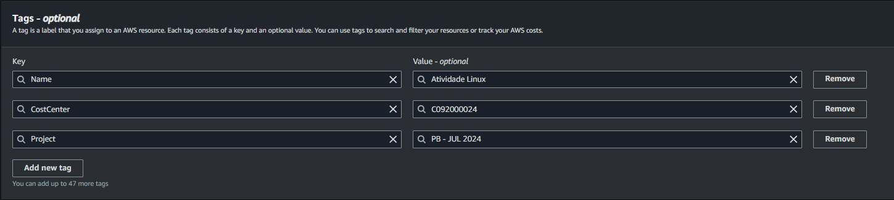
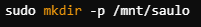
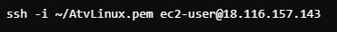
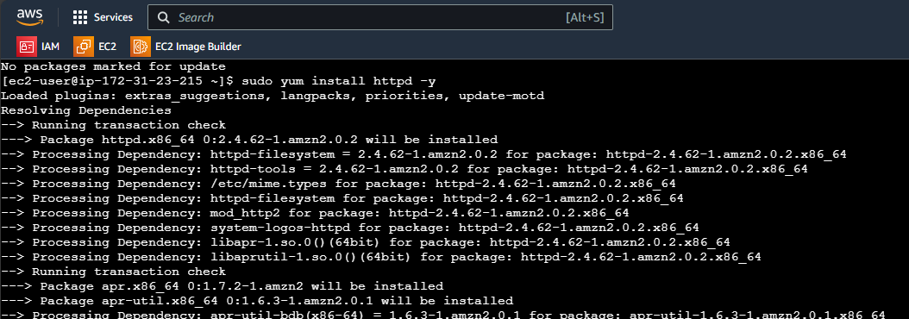

**#Acessando o Console AWS**

1. Acessar o console [AWS access portal (awsapps.com)](https://academy-compass.awsapps.com/start/#/?tab=accounts) e fazer o login com a conta Compass;
2. Ao acessar o console AWS entre em sua conta;

1. A próxima tela será a página Home do console que pode variar dependendo de sua personalização;

# Criando uma instância EC2

Para criar uma instância EC2 (Elastic Compute Cloud) na AWS, você pode seguir o passo a passo abaixo:

1. No console, vá para o serviço **_EC2_.** Para isso, clique em **_All_** **_Services_** no canto superior esquerdo e, em seguida, escolha **_EC2_** na seção **_Compute_**. Ou utilize o campo de pesquisa na parte superior da tela digitando **_EC2_**

1. No painel do EC2, clique no botão **_Launch Instance_**_._

1. Na próxima página, você precisará fornecer um nome para a instância e escolher algumas configurações de TAGs

**Por que usar TAGs?**

- **Organização**: TAGs ajudam a organizar recursos, permitindo categorizá-los por projeto, departamento, ambiente (produção, teste etc.) ou qualquer outro critério relevante.
- **Gerenciamento de custos**: Ao atribuir TAGs a recursos, você pode rastrear e associar custos a diferentes departamentos, projetos ou equipes, facilitando a alocação de custos.
- **Busca e filtragem**: TAGs facilitam a busca e filtragem de recursos dentro do console AWS, especialmente quando você tem muitos recursos.
- **Automação**: Tags podem ser usadas em scripts e automações para identificar e operar em um conjunto específico de recursos.

1. Escolha um nome para sua atividade, no caso usarei **_Atividade Linux_** e em seguida clique em vá em **_Add additional tags_**

1. Na tela aberta crie as TAGs de acordo com sua necessidade na opção Add new tag ( 1 ), para os projetos da Compass usamos o padrão da imagem abaixo.

A AMI é o sistema operacional e o software pré-configurado que a sua instância EC2 usará.

1. Em **_Application and OS Images (Amazon Machine Image - AMI)_**, você pode escolher uma imagem baseada em Linux (Ubuntu, Amazon Linux, Red Hat etc.) ou Windows. Neste caso usaremos a imagem solicitada no projeto

**_“Criar 1 instância EC2 com o sistema operacional Amazon Linux 2”_**

1. Em **_Instance type_** nosso projeto solicita uma configuração

**_“Família t3.small”_**

Para gerar uma chave pública para acesso ao ambiente AWS, você precisa criar um par de chaves (chave pública e chave privada) que será usado para autenticação.

1. Ao criar uma instância EC2, você será solicitado a escolher ou criar um par de chaves na seção **_Key Pair (login)_**. Vamos criar uma nova.

1. Nomeie o par de chaves e selecione o formato de arquivo:

- **PEM** (usado para Linux/Unix).
- **PPK** (usado para Windows com PuTTY).

Criaremos uma **_PEM_** pois utilizaremos para acesso no Linux

1. Devemos escolher o tipo de criptografia das chaves.

- RSA (Maior compatibilidade, menor velocidade e menos seguro com relação ao ED25519)
- ED25519 (Menor compatibilidade, maior velocidade, mais moderno e seguro se comparado ao RSA)

Como queremos ter a certeza de compatibilidade usaremos o **_RSA_** que não é inseguro e sim apenas tem uma segurança e velocidade inferior ao ED25519

Escolha as opções e em seguida **_Create key pair_** conforme imagem abaixo

**_ATENÇÃO: Clique em Download Key Pair para salvar a chave privada em seu computador. Essa é a única chance de baixar a chave privada._**

1. Devido ao projeto envolver acesso a um servidor web as opções **_Allow HTTPS traffic from de internet_** e **_Allow HTTP traffic from de internet_** foram habilitadas

1. O próximo passo é realizar a configuração de armazenamento e para este projeto usaremos **_16GBs,_** também optei pelo **GP3** no tipo de volume do EBS por se tratar de um tipo com maior desempenho e menor custo

1. Após realizar a configuração, clicar em **_Launch Instance_** para criar a nossa instância EC2 com as configurações necessárias para prosseguir com projeto

1. Aguarde a criação da instância, é para ser rápido.

1. A mensagem abaixo mostra sucesso na criação da instância

1. No menu esquerdo, acesse instância e verá que agora sua instância está criada e pronta para ser utilizada

**#Configurando um Elastic IP (EIP)**

Um Elastic IP (EIP) é um endereço IPv4 público fornecido pela Amazon Web Services (AWS) que pode ser alocado para uso com instâncias do EC2. Ele é um recurso de IP fixo que permanece constante, diferentemente dos endereços IP públicos padrão, que podem mudar se a instância for interrompida ou reiniciada.

1\. Entre no console AWS (Passo 1 do tutorial anterior);

2\. No painel de navegação à esquerda, clique em **_All services_** no grupo **_Compute_** acesse **_EC2_**

1. No painel esquerdo vá em **_Elastic IPs_**.

1. Clique em **_Allocate Elastic IP address_**.

1. Na tela seguinte, selecione a opção **_Amazon's pool of IPv4 addresses_,** adicione a tag do projeto para manter a organização e clique em **_Allocate_**_._

1. Anote o **_Elastic IP address_** que foi gerado e clique em **_Associate this Elastic IP address_**
   

1. Na janela de associação, escolha a instância EC2 que você deseja associar e clique em **_Associate_**.

Agora o Elastic IP está vinculado à sua instância EC2.

**#Liberando as portas de comunicação**

Um **Security Group** na **Amazon Web Services (AWS)** é uma configuração de firewall virtual que controla o tráfego de entrada e saída de recursos da AWS, como instâncias EC2. Ele define as regras que determinam quais tipos de tráfego podem alcançar ou sair de uma instância EC2, funcionando como uma camada adicional de segurança.

1. Acessar o Console AWS
2. No console do EC2, clique em **_Security Groups_** no painel de navegação à esquerda e em **_Create Security Group_**

Preencha as seguintes informações:

- **Name**: Insira um nome descritivo para o Security Group (ex.: AtvLinux).
- **Description**: Adicione uma descrição que ajude a identificar a finalidade desse grupo (ex.: Grupo de segurança para servidor web com HTTP e SSH liberados).
- **VPC**: Escolha a VPC em que você deseja criar o Security Group (a maioria dos usuários terá apenas uma VPC padrão).

Adicionar as regras de entrada da nossa Instancia

**Resumo das Regras Adicionadas**

| **Tipo** | **Protocolo** | **Faixa de portas** | **Origem** |
| --- | --- | --- | --- |
| SSH | TCP | 22  | 0.0.0.0/0 |
| Custom TCP | TCP | 111 | 0.0.0.0/0 |
| Custom UDP | UDP | 111 | 0.0.0.0/0 |
| Custom TCP | TCP | 2049 | 0.0.0.0/0 |
| Custom UDP | UDP | 2049 | 0.0.0.0/0 |
| HTTP | TCP | 80  | 0.0.0.0/0 |
| HTTPS | TCP | 443 | 0.0.0.0/0 |

Uma boa prática é adicionar as TAGs para manter a organização.

Mensagem de que nosso grupo de segurança foi criado com êxito

Não esqueça de associar o security group na instância que foi criada

A instância já está pronta e com as configurações solicitadas para nosso projeto.

**#Instalado e Configurando o NFS**

Atualizando os pacotes do servidor

Antes de instalar o NFS, é sempre bom garantir que seu sistema esteja com os pacotes atualizados

- - 1. use o comando **_sudo yum update -y_**

- - 1. Agora que os pacotes foram atualizados, execute o comando abaixo para instalar o serviço do NFS:

**_sudo yum install nfs-utils -y_**

Caso ja esteja instalado receberá esta mensagem

**Explicação**: O pacote nfs-utils contém os utilitários necessários para configurar e rodar o NFS no sistema. A opção -y confirma automaticamente a instalação.

- - 1. Após a instalação, você precisa iniciar o serviço NFS e garantir que ele seja iniciado automaticamente quando o sistema for reinicializado:

**Explicação**:

- **_systemctl start nfs-server_**: Inicia o serviço NFS.
- **systemctl enable nfs-server**: Configura o serviço NFS para iniciar automaticamente sempre que o sistema for ligado.

Você pode verificar se o NFS está rodando corretamente com o comando sudo systemctl status nfs-server. Isso deve te mostrar uma saída indicando que o serviço está ativo (rodando).

**_Criando o diretório que será compartilhado_**

Agora, precisamos criar o diretório no servidor que será compartilhado via NFS. Este diretório será acessível pelos clientes na rede.

1. Execute o seguinte comando para criar o diretório:

**_sudo mkdir -p /mnt/Saulo_**

**Explicação**:

- **mkdir:** Cria um diretório.
- **\-p:** Garante que o diretório será criado, mesmo que os diretórios pais (como /mnt) ainda não existam.

**Configurando permissões no diretório compartilhado**

Defina permissões apropriadas para o diretório, permitindo que clientes NFS possam acessá-lo. Execute os seguintes comandos:

1. Use os commandos abaixo

**_sudo chown nobody:nogroup /mnt/nfs_share_**

**_sudo chmod 777 /mnt/nfs_share_**

**Explicação**:

- **chown**: Altera o proprietário do diretório para o usuário nobody e o grupo nogroup, o que garante que o diretório seja acessível de forma genérica.
- **chmod 777**: garante que qualquer usuário (local ou remoto) tenha permissão para ler, escrever e executar dentro desse diretório.

**Configurando permissões no arquivo /etc/exports**

Certifique-se de que o arquivo **/etc/exports** no servidor NFS está configurado para permitir o acesso público.

Você precisa abrir o arquivo de configuração do NFS para adicionar essa linha. Faça isso com um editor de texto, como o nano.

1. Abra o arquivo /etc/exports

**_sudo nano_** **_/etc/exports_**

Adicione a linha de configuração abaixo ao arquivo

**_/mnt/saulo \*(rw,sync,no_subtree_check,no_root_squash)_**

Isso garante que qualquer máquina na internet poderá acessar o diretório compartilhado.

**Explicação:**

- **/mnt/saulo**: O diretório a ser compartilhado.
- **\***: Permite acesso de qualquer IP.
- **rw**: Os clientes podem ler e escrever no diretório.
- **sync**: Gravações são feitas imediatamente no disco do servidor.
- **no_subtree_check**: Desativa verificações de subárvore para melhorar o desempenho.
- **no_root_squash**: Permite que clientes root tenham permissões de root no servidor, o que deve ser usado com cuidado.

**ATENÇÃO**! Isso cria um compartilhamento público e acessível, mas esse tipo de configuração pode ser vulnerável a ataques se a segurança da rede não for adequada.

1. Depois de adicionar a linha, salve o arquivo

Pressione Ctrl + X para sair.

Pressione Y para confirmar que deseja salvar as alterações.

Pressione Enter para confirmar o nome do arquivo (ele já estará definido como /etc/exports)

Depois de salvar o arquivo /etc/exports, você precisa recarregar as configurações do NFS para que as novas regras entrem em vigor.

1. Execute o comando:

**_sudo exportfs -ra_**

Esse comando faz com que o NFS reavalie todas as exportações definidas no arquivo /etc/exports e aplique as mudanças.

**Explicação:**

- **sudo**: Executa o comando com privilégios de superusuário, necessários para modificar as exportações NFS.
- **exportfs**: Utilitário que gerencia a exportação de sistemas de arquivos NFS no servidor.
- **\-r**: Reexporta todos os sistemas de arquivos listados no arquivo /etc/exports. É utilizado para aplicar imediatamente quaisquer alterações feitas nesse arquivo sem precisar reiniciar o serviço NFS.
- **\-a**: Exporta todos os sistemas de arquivos especificados no arquivo /etc/exports. Garante que todas as configurações de exportação sejam processadas.

**Quando usar:**

- Após editar **/etc/exports**: Sempre que fizer alterações no arquivo /etc/exports para adicionar, remover ou modificar diretórios compartilhados, use sudo exportfs -ra para aplicar essas mudanças sem a necessidade de reiniciar o serviço NFS.

Depois disso, o NFS estará configurado para compartilhar o diretório /mnt/saulo publicamente com as permissões definidas.

**#Acessando o NFS**

Use uma máquina Linux para acessar com a chave .pem e neste caso foi utilizado uma máquina virtual com o Debian instalado.

1. Instalar o Cliente NFS (Se Ainda Não Estiver Instalado)

Instale o pacote nfs-utils, que inclui o cliente NFS

**_sudo apt-get update_**

**_sudo apt-get install -y nfs-common_**

nfs-common: Este pacote inclui os utilitários necessários para se conectar a servidores NFS.

1. Crie um diretório onde o compartilhamento NFS será montado

**_sudo mkdir -p /mnt/nfs_shared_**

/mnt/nfs_shared: Este é o diretório local onde o compartilhamento NFS será montado na máquina cliente.

1. Configurar a Montagem Automática no /etc/fstab editando o Arquivo /etc/fstab:

Abra o arquivo /etc/fstab com um editor de texto, neste caso o nano foi utilizado

**_sudo nano /etc/fstab_**

1. Adicione a seguinte linha ao final do arquivo /etc/fstab:

**_18.116.157.143:/mnt/saulo /mnt/nfs_shared nfs defaults 0 0_**

pressione CTRL + O para salvar e CTRL + X para sair

**Detalhes da Configuração:**

- **18.116.157.143:/mnt/saulo**: O endereço IP do servidor NFS seguido do caminho do diretório compartilhado no servidor.
- **/mnt/nfs_shared**: O caminho do diretório onde o compartilhamento NFS será montado na máquina cliente.
- **nfs**: Tipo de sistema de arquivos a ser montado.
- **defaults**: Opções de montagem padrão (rw, suid, dev, exec, auto, nouser, async).
- **0 0**: Opções para backup e verificação de sistema de arquivos (geralmente deixadas como 0 para montagens NFS).

1. Para montar imediatamente o compartilhamento NFS sem reiniciar a máquina use o comando abaixo.

**_sudo mount -a_**

Se você quiser montar o compartilhamento NFS manualmente sem editar o arquivo /etc/fstab, use o seguinte comando:

**_sudo mount -t nfs 18.116.157.143:/mnt/saulo /mnt/nfs_shared_**

**Detalhes do comando**

- **\-t nfs**: Especifica que o tipo de sistema de arquivos é NFS.
- **18.116.157.143:/mnt/saulo**: O endereço IP do servidor NFS e o caminho do diretório compartilhado.
- **/mnt/nfs_shared**: O diretório local onde o compartilhamento NFS será montado.

**_Nota:_** Essa montagem é temporária e será removida na próxima reinicialização

1. Verifique se o compartilhamento NFS foi montado corretamente:

**_df -h | grep nfs_**

1. Testar a Montagem Automática (Opcional)

Reiniciar a Máquina Cliente usando o **_sudo reboot_**

1. Verificar se a Montagem Persiste:

1. Para acessar o servidor NFS (neste caso, uma instância EC2) via SSH, use o seguinte comando:

**_ssh -i ~/AtvLinux.pem_** [**_ec2-user@18.116.157.143_**](mailto:ec2-user@18.116.157.143)

**Detalhes do comando**

- **\-i ~/AtvLinux.pem:** Especifica o caminho para a chave privada (AtvLinux.pem), necessária para a autenticação com a instância EC2.
- **ec2-user:** Nome do usuário padrão para instâncias Amazon Linux/Ubuntu na AWS.
- **18.116.157.143:** O endereço IP público da instância EC2 (servidor NFS).

1. Verificar o Status do Serviço NFS

**_sudo systemctl status nfs-server_**

1. Reiniciar o Serviço NFS (Se Necessário)

**_sudo systemctl restart nfs-server_**

1. Criar arquivo de teste

**_echo "Teste de compartilhamento NFS" > teste_nfs.txt_**

**Detalhes do comando**

- **echo:** Este comando é usado para exibir uma linha de texto ou uma string no terminal.
- **"Teste de compartilhamento NFS"**: Esta é a string que será exibida ou, neste caso, escrita em um arquivo. Você pode alterar este texto para qualquer outra mensagem que desejar.
- **\>**: Este é um operador de redirecionamento. Ele direciona a saída do comando echo para um arquivo. Se o arquivo especificado já existir, ele será sobrescrito. Se não existir, ele será criado.
- **teste_nfs.txt**: Este é o nome do arquivo de destino onde a saída do comando echo será escrita. Neste exemplo, o comando cria (ou sobrescreve) um arquivo chamado teste_nfs.txt e escreve a string "Teste de compartilhamento NFS" nele.

1. Verifica se o arquivo foi criado no diretório

**_ls -l /mnt/nfs_shared/teste_nfs.txt_**

**#Instalação do Apache**

- 1. Atualizar o servidor. Antes de instalar o Apache, é recomendável atualizar os pacotes do sistema:

**_sudo yum update -y_**

- 1. Agora, instale o Apache no seu servidor.

**_sudo yum install httpd -y_**

- 1. Depois da instalação, inicie o serviço do Apache e configure-o para iniciar automaticamente no boot.

**_sudo systemctl start httpd_**

**_sudo systemctl enable httpd_**

- 1. Certifique-se de que o Apache está rodando corretamente:

**_sudo systemctl status httpd_**

- 1. Para verificar se o Apache está funcionando corretamente, abra um navegador e digite o endereço IP do servidor. Se o Apache estiver configurado corretamente, você verá a página padrão do Apache.

<http://18.116.157.143>

# Script de monitoramento

**Objetivo:** Criar um script de monitoramento do servidor Apache onde no script deve conter:

Data / Hora;

Nome do Serviço;

Status do serviço;

Mensagem personalizada de online ou offline;

O script deve gerar 2 arquivos de saida: 1 para o serviço online e 1 para o serviço offline;

Preparar a execução automatizada do script a cada 5 minutos.

- 1. Acesse a máquina onde você deseja executar o script (no caso, [ec2-user@18.116.157.143](mailto:ec2-user@18.116.157.143)).
  2. Navegue até o diretório onde deseja criar o script, por exemplo, /home/ec2-user
  3. Use um editor de texto para criar o script **CheckApache.sh**:

- 1. Adicionar o Conteúdo do Script

**Script Detalhado:**

- **_#!/bin/bash_**: Esta linha define o interpretador do script, neste caso, /bin/bash. É importante para que o sistema saiba como executar o script.
- **_SERVICO="httpd"_**: Esta linha define o nome do serviço que será verificado. Aqui, ele está configurado para verificar o serviço httpd, que é o nome do Apache em distribuições como CentOS/Red Hat e pode ser ajustada para qualquer serviço que deseja monitorar
- **_DATA_HORA=$(date "+%Y-%m-%d %H:%M:%S")_**: Captura a data e a hora atual no formato "AAAA-MM-DD HH:MM usando o comando date. A data e a hora são armazenadas na variável DATA_HORA para serem usadas no log.
- **_if systemctl is-active --quiet $SERVICO; then_**: Usa o comando systemctl is-active para verificar se o serviço está ativo.
- **_\--quiet_** suprime a saída normal, retornando apenas o status.

Se o serviço estiver ativo, a condição é verdadeira e o bloco de código seguinte (then) será executado.

- **_STATUS="ONLINE"_**

**_MENSAGEM="O serviço $SERVICO está funcionando corretamente."_**

- **_echo "$DATA_HORA - $SERVICO - $STATUS - $MENSAGEM" >>_** **_/mnt/saulo/servico_online.log_**: Quando o serviço está ativo define STATUS como "ONLINE".

Define uma mensagem indicando que o serviço está funcionando corretamente.

Usa o comando echo para gravar a data, hora, nome do serviço, status e mensagem no arquivo /mnt/saulo/servico_online.log.

\>> é usado para anexar a mensagem ao arquivo, para que os registros não sejam sobrescritos.

- **_else_**

**_STATUS="OFFLINE"_**

**_MENSAGEM="O serviço $SERVICO está parado ou enfrentando problemas."_**

**_echo "$DATA_HORA - $SERVICO - $STATUS - $MENSAGEM" >> /mnt/saulo/servico_offline.log_**

**_fi_**

Se o serviço **não** estiver ativo: define STATUS como "OFFLINE".

Define uma mensagem indicando que o serviço está parado ou enfrentando problemas.

Usa o comando echo para gravar a data, hora, nome do serviço, status e mensagem no arquivo /mnt/saulo/servico_offline.log.

Assim como antes, >> é usado para anexar a mensagem ao arquivo.

- 1. A imagem mostra o comando sendo executado com sucesso no terminal de uma instância AWS EC2.

**_chmod +x /home/ec2-user/CheckApache.sh_**

**Explicação do Comando na Imagem**

- **chmod +x**: Este comando altera as permissões do arquivo para torná-lo executável.
- **/home/ec2-user/CheckApache.sh**: Este é o caminho para o script CheckApache.sh criado.

- 1. Execute o script manualmente para verificar se ele funciona:

**_/home/ec2-user/CheckApache.sh_**

- 1. Verifique se os logs foram gerados corretamente:

**_cat /mnt/saulo/servico_online.log_**

**_cat /mnt/saulo/servico_offline.log_**

**#Automatizando o Script**

O crontab é uma ferramenta do sistema Linux usada para agendar a execução automática de tarefas em horários específicos. Ele é parte do serviço cron, que é um "agendador de tarefas" que executa comandos ou scripts automaticamente em segundo plano, de acordo com um cronograma definido.

- 1. Para editar as tarefas do cron para o usuário atual (neste caso, ec2-user), use o seguinte comando:

**_crontab -e_**

1. Adicione a seguinte linha ao crontab para executar o script a cada 5 minutos e redirecionar a saída para um log em /tmp:

**_\*/5 \* \* \* \* /bin/bash /home/ec2-user/CheckApache.sh >> /tmp/CheckApache.log 2>&1_**

**Explicação da Sintaxe de Agendamento (\*/5 \* \* \* \*)**:

- **\*/5**: Este campo representa os **minutos**. Neste caso, \*/5 significa "a cada 5 minutos". O asterisco (\*) indica todos os valores possíveis e o /5 é um intervalo, significando que a tarefa será executada a cada 5 minutos (0, 5, 10, 15, etc.).
- **(Segundo Campo)**: Este campo representa as **horas**. Um único asterisco (\*) significa "todas as horas" (0-23). Assim, a tarefa será executada a cada 5 minutos de cada hora do dia.
- **(Terceiro Campo)**: Este campo representa os **dias do mês**. Um único asterisco (\*) indica "todos os dias do mês" (1-31).
- **(Quarto Campo)**: Este campo representa os **meses**. Um asterisco (\*) significa "todos os meses" (1-12).
- **(Quinto Campo)**: Este campo representa os **dias da semana**. Um asterisco (\*) significa "todos os dias da semana" (0-6, onde 0 é domingo).
  

**Explicação do restante do comando**

- **/bin/bash:** Especifica o interpretador Bash para executar o script.
- **/home/ec2-user/CheckApache.sh:** Caminho completo para o script a ser executado.
- **\>> /tmp/CheckApache.log 2>&1**: Redireciona a saída e erros do script para /tmp/CheckApache.log.

Caso queira checar o log de erro do script, use o comando:

**_cat /tmp/CheckApache.log_**

1. Comandos úteis do crontab

- **_crontab -l_**: lista as tarefas
- **crontab -r**: apaga todas as entradas do crontab sem confirmação

1. Comandos para verificar os logs

**Ls -l /mnt/saulo**: verifica se os logs estão na pasta do nfs

**cat /mnt/saulo/servico_online.log**: verifica o conteúdo dos logs de serviço online

**cat /mnt/saulo/servico_offline.log:** verifica o conteúdo dos logs de serviço offline

**#Exibição de logs na página do Apache**

**Tutorial: Exibindo Logs do Apache com Indicadores Visuais em PHP**

**Passo 1: Criar o Arquivo PHP para Exibir os Logs**

**Acessar o Servidor via SSH:**

Conecte-se ao servidor onde o Apache e os logs estão configurados:

**Navegar para o Diretório da Web:**

Vá para o diretório raiz da web do Apache (/var/www/html):

**Criar o Arquivo exibir_logs.php**

Crie um arquivo PHP chamado exibir_logs.php

**Adicionar o Código PHP**

**Passo 2: Testar a Página PHP**

Reinicie o Apache para aplicar as alterações

Acesse a página criada no navegador para visualizar os logs

<http://18.116.157.143/exibir_logs.php>

