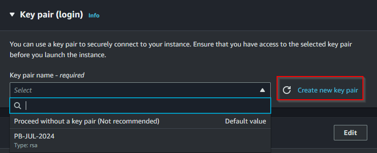
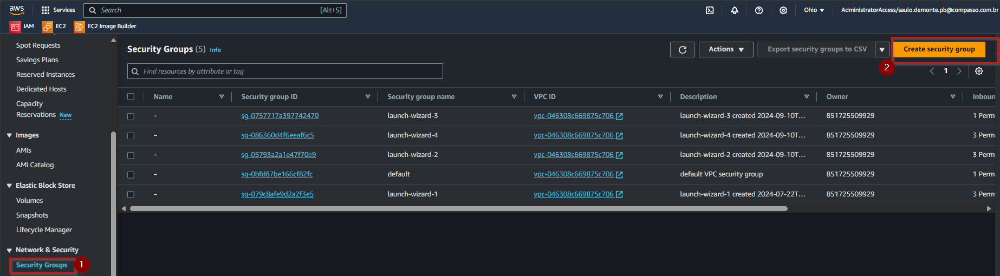

**#Acessando o Console AWS**

1. Acessar o console [AWS access portal (awsapps.com)](https://academy-compass.awsapps.com/start/#/?tab=accounts) e fazer o login com a conta Compass;
2. Ao acessar o console AWS entre em sua conta;

1. A próxima tela será a página Home do console que pode variar dependendo de sua personalização;

# Criando uma instância EC2

Para criar uma instância EC2 (Elastic Compute Cloud) na AWS, você pode seguir o passo a passo abaixo:

1. No console, vá para o serviço **_EC2_.** Para isso, clique em **_All_** **_Services_** no canto superior esquerdo e, em seguida, escolha **_EC2_** na seção **_Compute_**. Ou utilize o campo de pesquisa na parte superior da tela digitando **_EC2_**

1. No painel do EC2, clique no botão **_Launch Instance_**_._

1. Na próxima página, você precisará fornecer um nome para a instância e escolher algumas configurações de TAGs

**Por que usar TAGs?**

- **Organização**: TAGs ajudam a organizar recursos, permitindo categorizá-los por projeto, departamento, ambiente (produção, teste etc.) ou qualquer outro critério relevante.
- **Gerenciamento de custos**: Ao atribuir TAGs a recursos, você pode rastrear e associar custos a diferentes departamentos, projetos ou equipes, facilitando a alocação de custos.
- **Busca e filtragem**: TAGs facilitam a busca e filtragem de recursos dentro do console AWS, especialmente quando você tem muitos recursos.
- **Automação**: Tags podem ser usadas em scripts e automações para identificar e operar em um conjunto específico de recursos.

1. Escolha um nome para sua atividade, no caso usarei **_Atividade Linux_** e em seguida clique em vá em **_Add additional tags_**

1. Na tela aberta crie as TAGs de acordo com sua necessidade na opção Add new tag ( 1 ), para os projetos da Compass usamos o padrão da imagem abaixo.

A AMI é o sistema operacional e o software pré-configurado que a sua instância EC2 usará.

1. Em **_Application and OS Images (Amazon Machine Image - AMI)_**, você pode escolher uma imagem baseada em Linux (Ubuntu, Amazon Linux, Red Hat etc.) ou Windows. Neste caso usaremos a imagem solicitada no projeto

**_“Criar 1 instância EC2 com o sistema operacional Amazon Linux 2”_**

1. Em **_Instance type_** nosso projeto solicita uma configuração

**_“Família t3.small”_**

Para gerar uma chave pública para acesso ao ambiente AWS, você precisa criar um par de chaves (chave pública e chave privada) que será usado para autenticação.

1. Ao criar uma instância EC2, você será solicitado a escolher ou criar um par de chaves na seção **_Key Pair (login)_**. Vamos criar uma nova.

1. Nomeie o par de chaves e selecione o formato de arquivo:

- **PEM** (usado para Linux/Unix).
- **PPK** (usado para Windows com PuTTY).

Criaremos uma **_PEM_** pois utilizaremos para acesso no Linux

1. Devemos escolher o tipo de criptografia das chaves.

- RSA (Maior compatibilidade, menor velocidade e menos seguro com relação ao ED25519)
- ED25519 (Menor compatibilidade, maior velocidade, mais moderno e seguro se comparado ao RSA)

Como queremos ter a certeza de compatibilidade usaremos o **_RSA_** que não é inseguro e sim apenas tem uma segurança e velocidade inferior ao ED25519

Escolha as opções e em seguida **_Create key pair_** conforme imagem abaixo

**_ATENÇÃO: Clique em Download Key Pair para salvar a chave privada em seu computador. Essa é a única chance de baixar a chave privada._**

1. Devido ao projeto envolver acesso a um servidor web as opções **_Allow HTTPS traffic from de internet_** e **_Allow HTTP traffic from de internet_** foram habilitadas

1. O próximo passo é realizar a configuração de armazenamento e para este projeto usaremos **_16GBs,_** também optei pelo **GP3** no tipo de volume do EBS por se tratar de um tipo com maior desempenho e menor custo

1. Após realizar a configuração, clicar em **_Launch Instance_** para criar a nossa instância EC2 com as configurações necessárias para prosseguir com projeto

1. Aguarde a criação da instância, é para ser rápido.

1. A mensagem abaixo mostra sucesso na criação da instância

1. No menu esquerdo, acesse instância e verá que agora sua instância está criada e pronta para ser utilizada

**#Configurando um Elastic IP (EIP)**

Um Elastic IP (EIP) é um endereço IPv4 público fornecido pela Amazon Web Services (AWS) que pode ser alocado para uso com instâncias do EC2. Ele é um recurso de IP fixo que permanece constante, diferentemente dos endereços IP públicos padrão, que podem mudar se a instância for interrompida ou reiniciada.

1\. Entre no console AWS (Passo 1 do tutorial anterior);

2\. No painel de navegação à esquerda, clique em **_All services_** no grupo **_Compute_** acesse **_EC2_**

1. No painel esquerdo vá em **_Elastic IPs_**.

1. Clique em **_Allocate Elastic IP address_**.

1. Na tela seguinte, selecione a opção **_Amazon's pool of IPv4 addresses_,** adicione a tag do projeto para manter a organização e clique em **_Allocate_**_._

1. Anote o **_Elastic IP address_** que foi gerado e clique em **_Associate this Elastic IP address_**
   

1. Na janela de associação, escolha a instância EC2 que você deseja associar e clique em **_Associate_**.

Agora o Elastic IP está vinculado à sua instância EC2.

**#Liberando as portas de comunicação**

Um **Security Group** na **Amazon Web Services (AWS)** é uma configuração de firewall virtual que controla o tráfego de entrada e saída de recursos da AWS, como instâncias EC2. Ele define as regras que determinam quais tipos de tráfego podem alcançar ou sair de uma instância EC2, funcionando como uma camada adicional de segurança.

1. Acessar o Console AWS
2. No console do EC2, clique em **_Security Groups_** no painel de navegação à esquerda e em **_Create Security Group_**

Preencha as seguintes informações:

- **Name**: Insira um nome descritivo para o Security Group (ex.: AtvLinux).
- **Description**: Adicione uma descrição que ajude a identificar a finalidade desse grupo (ex.: Grupo de segurança para servidor web com HTTP e SSH liberados).
- **VPC**: Escolha a VPC em que você deseja criar o Security Group (a maioria dos usuários terá apenas uma VPC padrão).

Adicionar as regras de entrada da nossa Instancia

**Resumo das Regras Adicionadas**

| **Tipo** | **Protocolo** | **Faixa de portas** | **Origem** |
| --- | --- | --- | --- |
| SSH | TCP | 22  | 0.0.0.0/0 |
| Custom TCP | TCP | 111 | 0.0.0.0/0 |
| Custom UDP | UDP | 111 | 0.0.0.0/0 |
| Custom TCP | TCP | 2049 | 0.0.0.0/0 |
| Custom UDP | UDP | 2049 | 0.0.0.0/0 |
| HTTP | TCP | 80  | 0.0.0.0/0 |
| HTTPS | TCP | 443 | 0.0.0.0/0 |

Uma boa prática é adicionar as TAGs para manter a organização.

Mensagem de que nosso grupo de segurança foi criado com êxito

Não esqueça de associar o security group na instância que foi criada

A instância já está pronta e com as configurações solicitadas para nosso projeto.

**#Instalado e Configurando o NFS**

Atualizando os pacotes do servidor

Antes de instalar o NFS, é sempre bom garantir que seu sistema esteja com os pacotes atualizados

- - 1. use o comando **_sudo yum update -y_**

- - 1. Agora que os pacotes foram atualizados, execute o comando abaixo para instalar o serviço do NFS:

**_sudo yum install nfs-utils -y_**

Caso ja esteja instalado receberá esta mensagem

