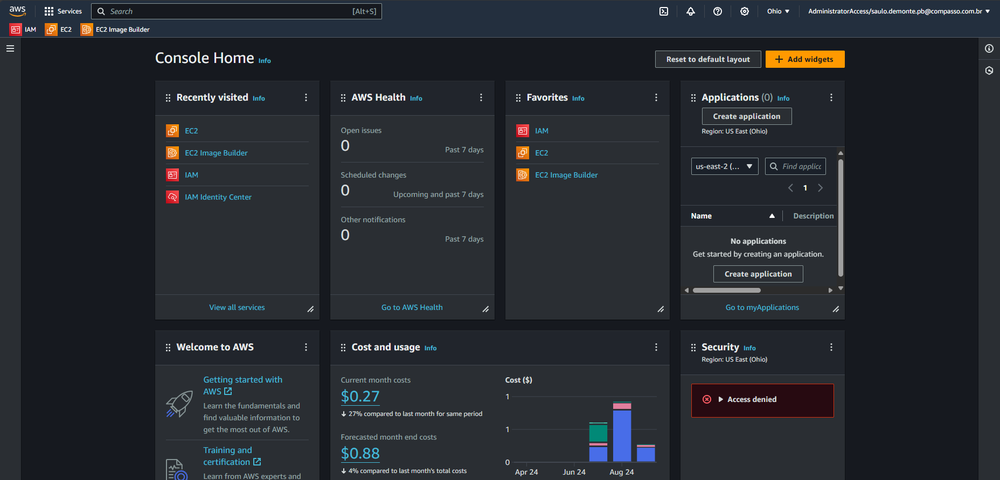
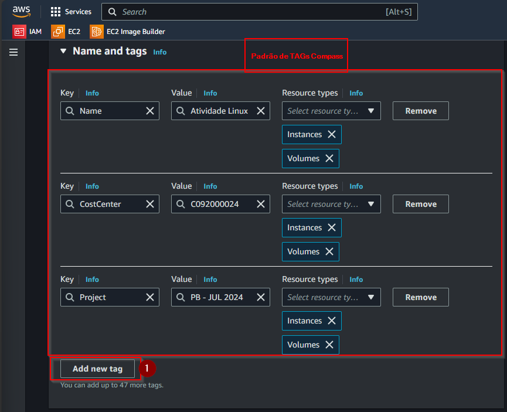
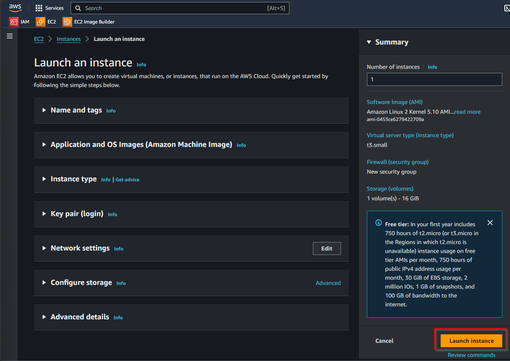

**#Acessando o Console AWS**

1. Acessar o console [AWS access portal (awsapps.com)](https://academy-compass.awsapps.com/start/#/?tab=accounts) e fazer o login com a conta Compass;
2. Ao acessar o console AWS entre em sua conta;

1. A próxima tela será a página Home do console que pode variar dependendo de sua personalização;

# Criando uma instância EC2

Para criar uma instância EC2 (Elastic Compute Cloud) na AWS, você pode seguir o passo a passo abaixo:

1. No console, vá para o serviço **_EC2_.** Para isso, clique em **_All_** **_Services_** no canto superior esquerdo e, em seguida, escolha **_EC2_** na seção **_Compute_**. Ou utilize o campo de pesquisa na parte superior da tela digitando **_EC2_**

1. No painel do EC2, clique no botão **_Launch Instance_**_._

1. Na próxima página, você precisará fornecer um nome para a instância e escolher algumas configurações de TAGs

**Por que usar TAGs?**

- **Organização**: TAGs ajudam a organizar recursos, permitindo categorizá-los por projeto, departamento, ambiente (produção, teste etc.) ou qualquer outro critério relevante.
- **Gerenciamento de custos**: Ao atribuir TAGs a recursos, você pode rastrear e associar custos a diferentes departamentos, projetos ou equipes, facilitando a alocação de custos.
- **Busca e filtragem**: TAGs facilitam a busca e filtragem de recursos dentro do console AWS, especialmente quando você tem muitos recursos.
- **Automação**: Tags podem ser usadas em scripts e automações para identificar e operar em um conjunto específico de recursos.

1. Escolha um nome para sua atividade, no caso usarei **_Atividade Linux_** e em seguida clique em vá em **_Add additional tags_**

1. Na tela aberta crie as TAGs de acordo com sua necessidade na opção Add new tag ( 1 ), para os projetos da Compass usamos o padrão da imagem abaixo.

A AMI é o sistema operacional e o software pré-configurado que a sua instância EC2 usará.

1. Em **_Application and OS Images (Amazon Machine Image - AMI)_**, você pode escolher uma imagem baseada em Linux (Ubuntu, Amazon Linux, Red Hat etc.) ou Windows. Neste caso usaremos a imagem solicitada no projeto

**_“Criar 1 instância EC2 com o sistema operacional Amazon Linux 2”_**

1. Em **_Instance type_** nosso projeto solicita uma configuração

**_“Família t3.small”_**

Para gerar uma chave pública para acesso ao ambiente AWS, você precisa criar um par de chaves (chave pública e chave privada) que será usado para autenticação.

1. Ao criar uma instância EC2, você será solicitado a escolher ou criar um par de chaves na seção **_Key Pair (login)_**. Vamos criar uma nova.

1. Nomeie o par de chaves e selecione o formato de arquivo:

- **PEM** (usado para Linux/Unix).
- **PPK** (usado para Windows com PuTTY).

Criaremos uma **_PEM_** pois utilizaremos para acesso no Linux

1. Devemos escolher o tipo de criptografia das chaves.

- RSA (Maior compatibilidade, menor velocidade e menos seguro com relação ao ED25519)
- ED25519 (Menor compatibilidade, maior velocidade, mais moderno e seguro se comparado ao RSA)

Como queremos ter a certeza de compatibilidade usaremos o **_RSA_** que não é inseguro e sim apenas tem uma segurança e velocidade inferior ao ED25519

Escolha as opções e em seguida **_Create key pair_** conforme imagem abaixo

**_ATENÇÃO: Clique em Download Key Pair para salvar a chave privada em seu computador. Essa é a única chance de baixar a chave privada._**

1. Devido ao projeto envolver acesso a um servidor web as opções **_Allow HTTPS traffic from de internet_** e **_Allow HTTP traffic from de internet_** foram habilitadas

1. O próximo passo é realizar a configuração de armazenamento e para este projeto usaremos **_16GBs,_** também optei pelo **GP3** no tipo de volume do EBS por se tratar de um tipo com maior desempenho e menor custo

1. Após realizar a configuração, clicar em **_Launch Instance_** para criar a nossa instância EC2 com as configurações necessárias para prosseguir com projeto

1. Aguarde a criação da instância, é para ser rápido.

1. A mensagem abaixo mostra sucesso na criação da instância

1. No menu esquerdo, acesse instância e verá que agora sua instância está criada e pronta para ser utilizada

**#Configurando um Elastic IP (EIP)**

Um Elastic IP (EIP) é um endereço IPv4 público fornecido pela Amazon Web Services (AWS) que pode ser alocado para uso com instâncias do EC2. Ele é um recurso de IP fixo que permanece constante, diferentemente dos endereços IP públicos padrão, que podem mudar se a instância for interrompida ou reiniciada.

1\. Entre no console AWS (Passo 1 do tutorial anterior);

2\. No painel de navegação à esquerda, clique em **_All services_** no grupo **_Compute_** acesse **_EC2_**

